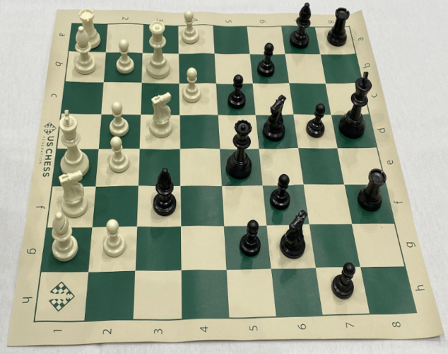
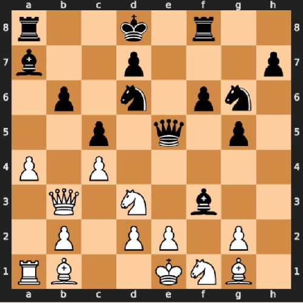
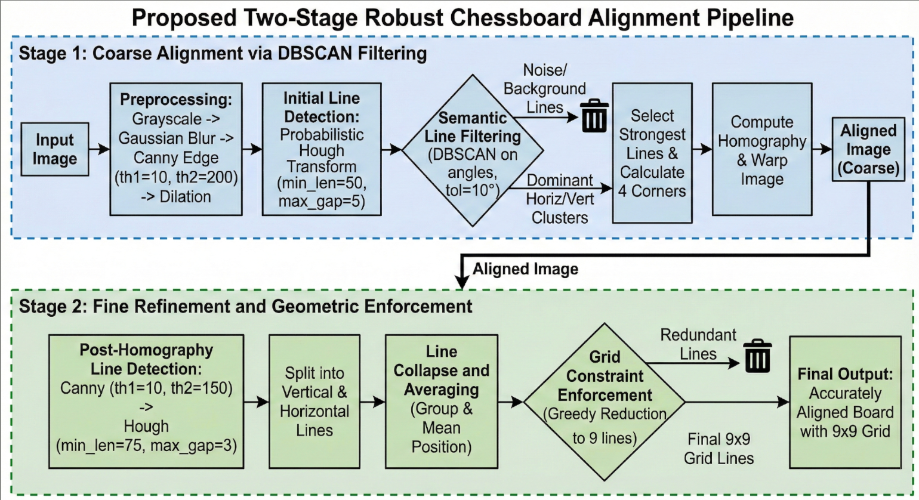

# Chess Board Recognition & Piece Classification

This project utilizes Computer Vision and Machine Learning to digitally reconstruct a chess game from a raw image of a physical chessboard.

| Input | Output |
|-------|--------|
|  |  |

## Project Structure

The project is composed of two main Jupyter notebooks:

### 1. Training (`training_file.ipynb`)
* **Goal:** Train a classifier to recognize specific chess pieces.
* **Method:** Uses DINOv2 (Vision Transformer) to extract features and trains a Support Vector Machine (SVM) on the dataset in 'data/'.
* **Output:** Saves the trained model weights to the `models/` folder for later use.

### 2. Classification (`classification_file.ipynb`)
* **Goal:** Reconstruct the game state (FEN/PGN) from a board image.
* **Method:**
    1.  Takes an input image of a chessboard.
    2.  Applies Computer Vision techniques (OpenCV) to detect the board and segment the squares.
    3.  Uses the saved SVM model to classify the content of each square (Empty, Pawn, Knight, etc.).
    4.  Rebuilds the digital representation of the game.

---

## Installation

You can install all necessary dependencies for both the training and classification modules with a single command:

```bash
pip install opencv-python numpy matplotlib scipy scikit-learn torch torchvision joblib Pillow python-chess ipython seaborn tqdm
```

For the Classification Notebook:

```bash
pip install opencv-python numpy matplotlib scipy scikit-learn torch torchvision joblib Pillow python-chess ipython
```

For the Training Notebook:
```bash
pip install torch torchvision scikit-learn numpy matplotlib seaborn tqdm joblib
```

Usage Notes

Limitations
Board Style: The current model is strictly optimized for green/white style boards (as seen in the boards/ folder).

Generalization: The dataset used for training included only this specific board style. To support wooden, blue, or other board types, the training dataset would need to be expanded to include those variations.

---



*Computer vision techniques used for piece extraction, tile extraction, and board alignment.*


***
